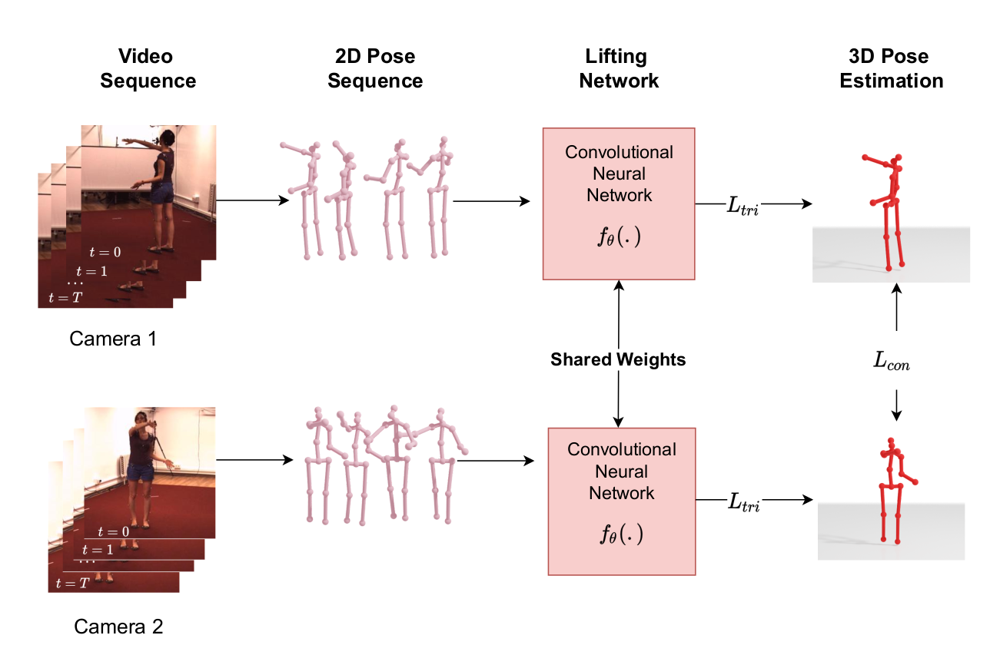

<div align="center">

<h1>Learning Temporal 3D Human Pose Estimation with Pseudo Labels </h1>


Official PyTorch Implementation of the paper: Learning Temporal 3D Human Pose Estimation with Pseudo Labels.

Arij Bouazizi, Ulrich Kressel, and Vasileios Belagiannis


 [[Proceedings](https://ieeexplore.ieee.org/document/9663755)] [[Papers with Code](https://paperswithcode.com/paper/learning-temporal-3d-human-pose-estimation)] [[Arxiv](https://arxiv.org/abs/2110.07578)]


</div>


<div align="right">

</div>

## Installation

To setup the environment:
```sh
cd TM_HPE
conda create -n TM_HPE python=3.8.8
conda activate TM_HPE
pip install -r requirements.txt
```

## Data

Due to licensing it is not possible to provide any data. Please refer to [VideoPose3D](https://github.com/facebookresearch/VideoPose3D) for the preparation of the dataset files.

## Training

To train the model on h36m or amass, you can use the following commands:
 ```
 python h36m/train_h36m.py --input_n 10 --output_n 25 --skip_rate 1 
 ```
 ```
 python amass/train_3dhp.py --input_n 10 --output_n 25 --skip_rate 5 
 ```
 
 ## Evaluation

To test the pretrained models, you can use the following commands:
 ```
 python h36m/test_h36m.py --input_n 10 --output_n 25 --skip_rate 1 
 ```
 ```
 python amass/test_h36m.py --input_n 10 --output_n 25 --skip_rate 5 
 ```
 
 ## Models

We release the pretrained models for academic purpose. You can download them from. Unzip the .zip file in the ```/checkpoints``` directory.

## Citation

If you find this code useful for your research, please consider citing the following paper:

```latex
@inproceedings{bouazizi2021learning,
  title={Learning temporal 3d human pose estimation with pseudo-labels},
  author={Bouazizi, Arij and Kressel, Ulrich and Belagiannis, Vasileios},
  booktitle={2021 17th IEEE International Conference on Advanced Video and Signal Based Surveillance (AVSS)},
  pages={1--8},
  year={2021},
  organization={IEEE}
}

```

 ## Acknowledgments
 
 Some of our code was adapted from [VideoPose3D](https://github.com/facebookresearch/VideoPose3D). We thank the authors for making their code public.
 
## License

<a rel="license" href="http://creativecommons.org/licenses/by-nc/4.0/">
</a><br />This work is licensed under <a rel="license" href="http://creativecommons.org/licenses/by-nc/4.0/"
 >Creative Commons Attribution-NonCommercial 4.0 International License</a>.

